# Mobile_Computing_Assignments
All  Assignments done in Mobile Computing course in Indraprastha Institute of Information Technology, Delhi (IIITD).

## Table Of Contents

|S.NO|                               TOPICS                                                 | PROJECT NAME      |
|----|--------------------------------------------------------------------------------------|-------------------|
|01. | Basics of Android : **Activity, Intent and Log and Rotation Handling** |[001_Android_Activity](001_Android_Activity/)      |
|02. |Basic Music Application using : **fragment , service (foreground with notifications), Broadcast Receivers** for complete application, Check Connection, **Async Task to download song internal to the app** ,play songs from raw and internal files     |[002_Service_Broadcast-Receiver_and_Async-Task](002_Service_Broadcast-Receiver_and_Async-Task/)     |                                          
|03. | Displaying and Editing list of students using **Recycler View, Adapter (No Database)**   |[003_Recyclerview_and_Fragments](003_Recyclerview_and_Fragments/)  |
|04. |Recording real time **sensor** data and storing in **Room database** while retrieving mean of data till date |[004_Android_Sensors_and_Room_Database](004_Android_Sensors_and_Room_Database/)  |
|05. | **Indoor Localization** using wifi with room level accuracy : access wifi available, record RSI level, Localize using **War driving and KNN**,also Plotting data in android  |[005_Indoor_Localization_using_Wifi](005_Indoor_Localization_using_Wifi/)       |

## Outputs 

## 001_Android_Activity

                                   Fig 1. Basic Android Activity and Intents usage 

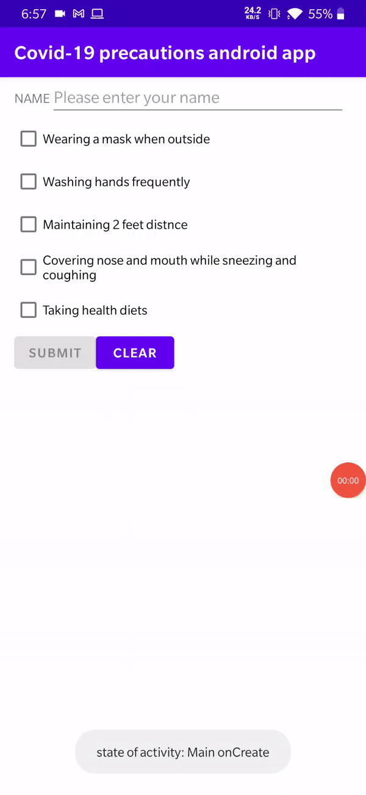

## 002_Service_Broadcast-Receiver_and_Async-Task

                                   Fig 2. Music Application with play and pause functionality (foreground service) and download file using async task 

## 003_Recyclerview_and_Fragments

                                   Fig 3. Recycler View in Android

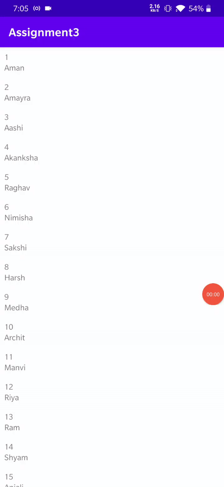

## 004_Android_Sensors_and_Room_Database

- Following sensor data captured : 
  - Proximity
  - Light
  - Gyroscope 
  - Accelerometer 
  - GPS
  - Gravity 

                                   Fig 4. Recording real time data from sensors and checking mobility 

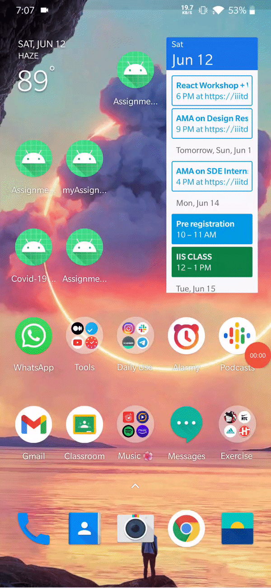

                                   Fig 5. Room Database for different sensors

 <table>
  <tr>
    <td>All Room tables</td>
    
     
  </tr>
  <tr>
    <td>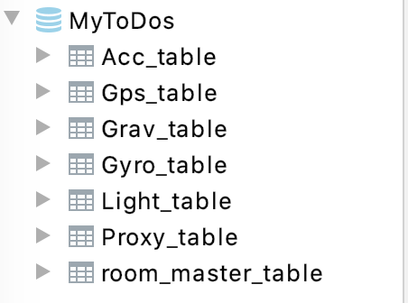</
  </tr>
 </table> 

  <table>
  <tr>
    <td>Accelerometer sensor table</td>
    <td>Light sensor table</td>
     
  </tr>
  <tr>
    <td>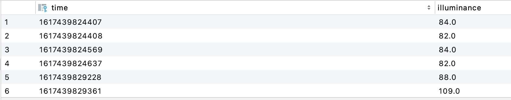</td>
    <td>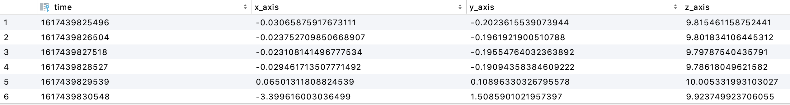</td>
    
  </tr>
 </table> 

## 005_Indoor_Localization_using_Wifi

- Implemented Localization using War driving with wifi 
- Collect Initial data for War driving
    - Detect wifi devices to record RSI values from them. 
    - Collect training data for war driving i.e which room receives what RSI values from wifi devices near it (room level accuracy)
    . Using these we know room1 receives [x1,x2,x3] rsi values for wifi [y1,y2,y3] respectively. if any prediction point [z1,z2,z3] is close to [x1,x2,x3] for same wifi devices [y1,y2,y3] then we can predict the location to be room1.  
    - For finding location simply we find euclidean distances and use k nearest neighbor to localize the room of the user.  

                                   Fig 6. Indoor Localization using Wifi  

 <table>
  <tr>
    <td>Available wifi list with RSI values</td>
     <td>War driving data collection with selected wifi devices</td>
     <td>Prediction using KNN</td>
     <td>Wifi Scanner using Bar plots</td>
  </tr>
  <tr>
    <td>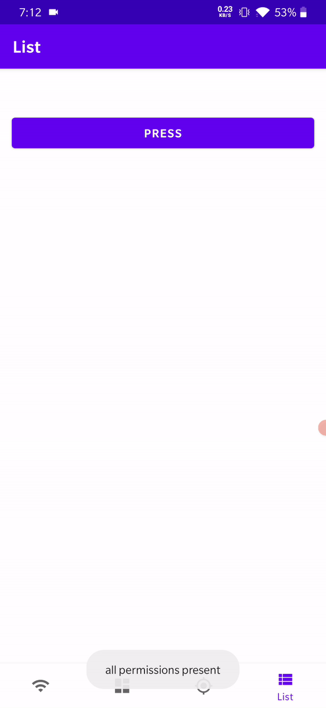</td>
    <td>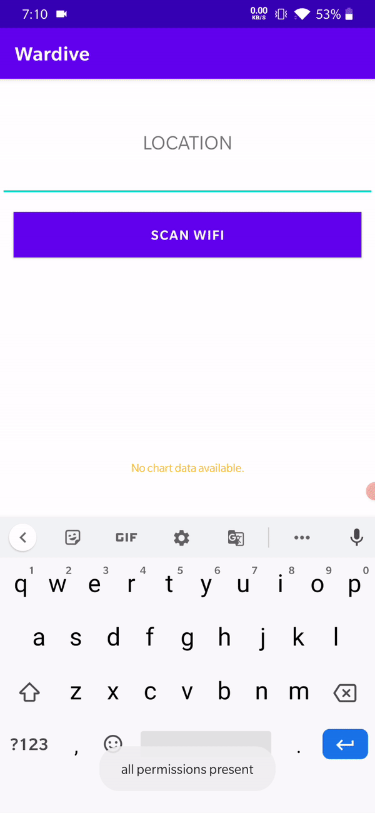</td>
    <td>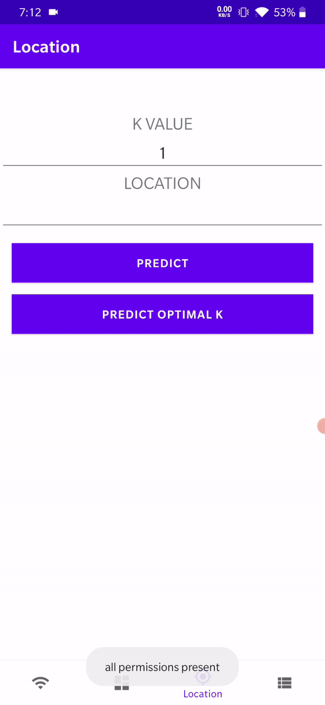</td>
    <td>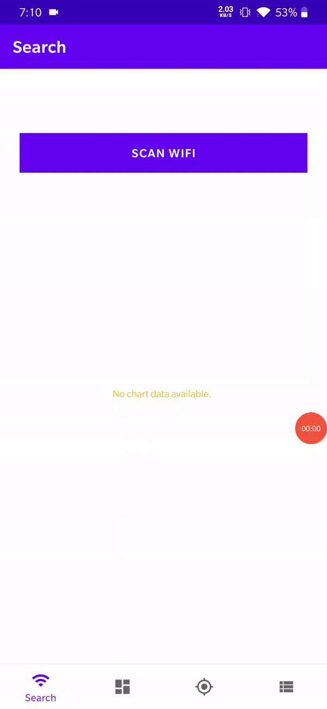</td>
  </tr>
 </table> 

                                    Fig 6. War driving data collected  

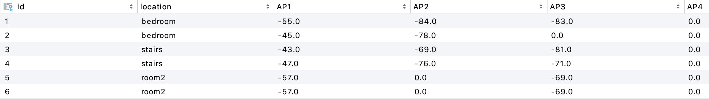

